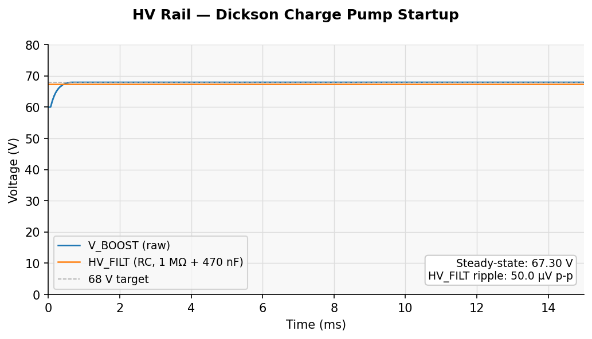
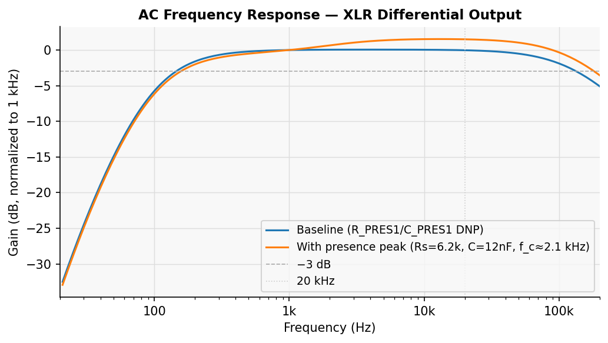
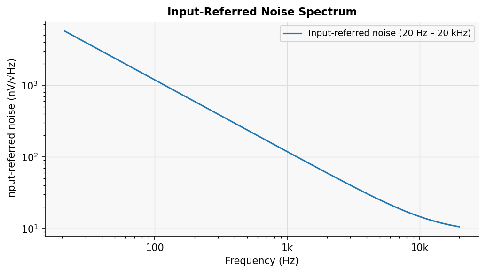
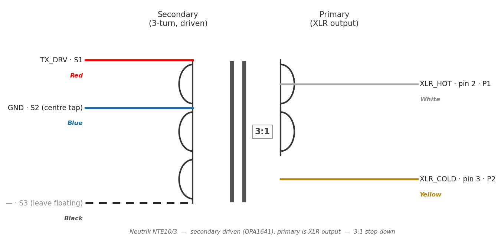
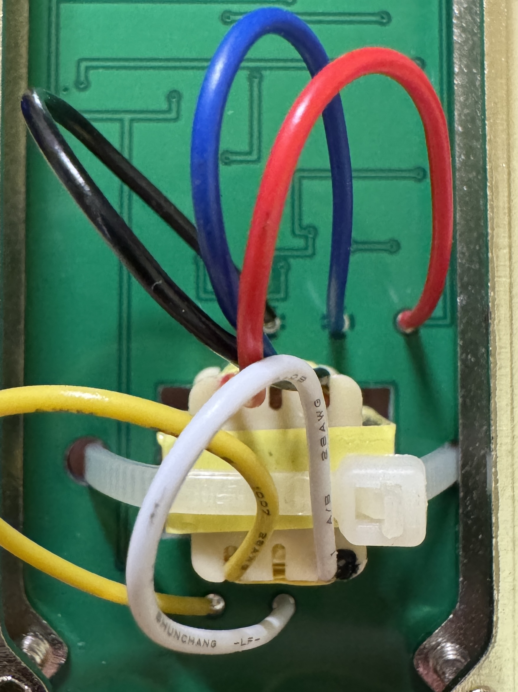

# Op-Amp Transformer Condenser Microphone

A code-driven open true condenser microphone. PCB layout, schematic, BOM, and CPL are all generated from Python scripts.


## Overview

This design uses a Dickson charge pump oscillator to generate a 68 V HV rail from 48 V phantom power, providing ~55 V capsule polarization (HV_FILT − 12 V midpoint), and feeds a transformer-coupled output stage built around a low-noise op-amp. The reference implementation uses the **OPA1641** (2.5 nV/√Hz, JFET input), chosen for its low voltage noise and LCSC availability. The circuit fits on a 36 × 93 mm 2-layer PCB.

**Key design points:**
- Op-amp output stage; reference design uses OPA1641 (2.5 nV/√Hz voltage noise)
- NTE10/3 audio transformer, 3:1 step-down, transformer-coupled output
- CD40106B Schmitt-trigger oscillator + 3-stage active Dickson charge pump
- 55 V capsule polarization (HV_FILT ≈ 67.3 V, BZT52C68-clamped, referenced to 12 V midpoint)
- HV rail RC filter: 1 MΩ (R_HV) + 470 nF, corner ~0.34 Hz; no LC resonance
- Output sensitivity ~−48 dBV/Pa default (R6 = 5.6 kΩ, gain ≈ 3.5×); ~−38 dBV/Pa hi-gain (R6 = 47 kΩ, gain ≈ 22×)
- RFI filter on XLR output: differential RC network (R_RFI1/R_RFI2 + C_RFI1/C_RFI2)
- Phantom power draw: ~2.4–3 mA typical (IEC 61938 limit: 14 mA)
- All SMD/THT components available from standard distributors (LCSC, Mouser, Digi-Key); capsule and transformer are customer-supplied
- Build variants (`--hi-gain`, `--presence`) selectable at BOM generation time — no schematic changes required

## Simulated Performance

Run with ngspice from `sim/` (see [Running Simulations](#running-simulations)):

| Parameter | Simulated | Notes |
|---|---|---|
| V_BOOST steady-state | 67.97 V | target 68.2 V, DZ1-clamped |
| HV_FILT DC | 67.30 V | 0.67 V drop across R_HV (1 MΩ × 0.67 µA load) |
| HV_FILT ripple | ~47 nV p-p calc | RC at 100 kHz: −109 dB; LC ref sim: 10 µV p-p |
| RC filter corner | ~0.34 Hz | R_HV=1 MΩ × C9=470 nF; no LC resonance |
| Capsule polarization | ~55 V | HV_FILT (67.3 V) − V_MID (12 V) at steady state |

### HV Rail Startup (`boost_dickson.sp`)



Charge pump settles to ~68 V within ~1 ms. HV_FILT (RC-filtered, 1 MΩ + 470 nF) steady-state is 67.3 V (0.67 V drop across R_HV); theoretical ripple ~47 nV p-p at 100 kHz (−109 dB). Plot shows LC reference run (IC=60 V) for startup transient visibility.

### AC Frequency Response (`amp_ac.sp`)



Behavioral model, gain normalized to 1 kHz. The **blue curve** (baseline / DNP) is flat within ±1 dB from ~200 Hz to ~20 kHz; high-pass rolloff from output DC block (C_DC = 4.7 µF) and R_GBIAS (100 MΩ) × capsule capacitance (55 pF). The **orange curve** shows the optional presence-peak network populated: +2.6 dB shelving above f_c ≈ 2.1 kHz.

#### Optional presence-peak network (R_PRES1, C_PRES1)

R_PRES1 (6.2 kΩ) and C_PRES1 (12 nF) in series, parallel with R3 (2.2 kΩ), are footprinted on the board but **DNP by default**. If the capsule you use has a relatively flat frequency response and you'd like to add some presence lift, populate these two parts. The corner frequency and boost level can be tuned by adjusting their values:

- **Corner frequency**: f_c = 1 / (2π × R_PRES1 × C_PRES1) ≈ 2.1 kHz at the default values
- **HF shelf**: set by R_PRES1 ∥ R3; default +2.6 dB

`gen_bom.py` generates four BOM/CPL pairs in one run. The default build (`bom.csv` / `cpl.csv`, R6=5.6 kΩ, R_PRES1/C_PRES1 DNP) is packaged in the `fabrication-outputs` CI artifact. The three variant pairs (`-hi-gain`, `-presence`, `-hi-gain-presence`) are packaged in the `bom-variants` artifact.

| File suffix | R6 | Presence network | Notes |
|---|---|---|---|
| *(none)* | 5.6 kΩ | DNP | Default — more headroom, flat response |
| `-hi-gain` | 47 kΩ | DNP | Higher output level, transformer coloring |
| `-presence` | 5.6 kΩ | populated | Flat gain + +2.6 dB shelf above 2.1 kHz |
| `-hi-gain-presence` | 47 kΩ | populated | High-gain + presence lift |

### Input-Referred Noise Spectrum (`amp_noise_opa1641.sp`)



SPICE input-referred noise, computed by dividing total output noise by the signal transfer function at each frequency. The slope reflects the signal path's high-pass characteristic (coupling caps attenuate low-frequency signal more than noise), not a real frequency-dependent noise source. Midband (1–10 kHz) noise floor is dominated by R_GBIAS Johnson noise (~27 nV/√Hz at 100 MΩ) and OPA1641 voltage noise (2.5 nV/√Hz).

## Hardware Requirements

### Customer-supplied (not in PCBA BOM)
| Item | Spec | Notes |
|---|---|---|
| Capsule | Single-diaphragm condenser | Design delivers 56 V polarization (68 V HV rail − 12 V V_MID). Compatible with most standard large/small-diaphragm capsules; K47-type capsules (typically rated 40–60 V) are compatible at this voltage. |
| Transformer | **Neutrik NTE10/3** (3:1, audio) | Mouser / Newark. No other transformer is currently supported; the PCB cutout and solder pads are sized for this specific part. |

### Transformer wiring

The NTE10/3 has 5 free wires and connects to two sets of bare solder pads on the PCB (5 mm pitch). The circuit uses the transformer in reverse — the secondary (3-turn tap) is driven from the OPA1641 and the primary is the XLR output, giving a 3:1 step-down.





Pad numbers run left to right as viewed from the **front** (component side). The photo above shows the board from the back, so left and right are mirrored.

**TP1 — 3 pads above transformer cutout (secondary, driven side)**

| Pad | Net | Wire colour |
|---|---|---|
| S1 (leftmost) | TX\_DRV | **Red** — 3-turn tap (signal in) |
| S2 (centre) | GND | **Blue** — centre tap (return) |
| S3 (rightmost) | — (floating) | **Black** — far end of winding; leave unconnected |

> **Full winding option:** swap S2 and S3 — connect **Black** (S3) to GND, leave **Blue** (S2) unconnected. This uses the complete secondary winding and reduces output level by ~10.5 dB relative to the default. Combine with the `-hi-gain` BOM variant (R6 = 47 kΩ) to partially compensate for the lower sensitivity.

**TS1 — 2 pads below transformer cutout (primary, XLR output)**

| Pad | Net | Wire colour |
|---|---|---|
| P1 (leftmost) | XLR\_HOT (XLR pin 2) | **White** |
| P2 (rightmost) | XLR\_COLD (XLR pin 3) | **Yellow** |

### PCB
- 2-layer, 36 × 93 mm, ENIG or HASL
- All other components sourced from standard distributors; LCSC part numbers included in BOM
- 4 × M2.5 mounting holes with GND pads for chassis bonding — 28 mm horizontal span, 80 mm vertical span

## Software Requirements

| Tool | Version | Purpose |
|---|---|---|
| Python | 3.8+ | PCB / schematic / BOM generation |
| KiCad | 9.0.x | PCB editor; provides `pcbnew` Python module |
| kicad-cli | 9.0.x | Gerber / drill export, DRC / ERC (bundled with KiCad) |
| ngspice | any recent | SPICE simulation (optional) |
| numpy | any recent | Simulation plot generation (`sim/plot_all.py`) |
| matplotlib | any recent | Simulation plot generation (`sim/plot_all.py`) |

## Generating Outputs

Run from the **project root** (the directory containing this README).

### 1. Generate KiCad files

```bash
python pcb/gen_project.py    # writes pcb/open-condenser-mic.kicad_pro
python pcb/gen_pcb.py        # writes pcb/open-condenser-mic.kicad_pcb
python pcb/gen_schematic.py  # writes pcb/open-condenser-mic.kicad_sch
```

All three scripts accept `--name PROJECT_NAME` to change the output filename (default: `open-condenser-mic`). After generating, open the project in KiCad via **File → Open Project** and select `pcb/open-condenser-mic.kicad_pro`.

A pre-rendered schematic PDF is available at [docs/schematic.pdf](docs/schematic.pdf). To regenerate it:

```bash
kicad-cli sch export pdf --black-and-white --output docs/schematic.pdf pcb/open-condenser-mic.kicad_sch
```

### 2. Export gerbers

`gen_pcb.py` fills all copper zones itself before writing the board file, so no manual zone-fill step is needed. Export gerbers and drill files via **File → Fabrication Outputs** in KiCad, or from the command line:

```bash
kicad-cli pcb export gerbers --output fab/ pcb/open-condenser-mic.kicad_pcb
kicad-cli pcb export drill   --output fab/ pcb/open-condenser-mic.kicad_pcb
```

Run DRC / ERC before fabricating:

```bash
kicad-cli pcb drc --severity-error --exit-code-violations pcb/open-condenser-mic.kicad_pcb
kicad-cli sch erc --severity-error --exit-code-violations pcb/open-condenser-mic.kicad_sch
```

### 3. Generate BOM and CPL

```bash
python pcb/gen_bom.py                    # → bom.csv / cpl.csv          (default: R6=5.6k, presence DNP)
python pcb/gen_bom.py --hi-gain          # → bom-hi-gain.csv / cpl-hi-gain.csv
python pcb/gen_bom.py --presence         # → bom-presence.csv / cpl-presence.csv
python pcb/gen_bom.py --hi-gain --presence  # → bom-hi-gain-presence.csv / cpl-hi-gain-presence.csv
```

## Running Simulations

All simulations use ngspice. Run from the `sim/` directory.

```bash
cd sim
ngspice boost_dickson.sp      # HV rail: VBOOST steady-state + ripple
ngspice amp_noise_opa1641.sp  # Input-referred noise, OPA1641 model
ngspice amp_ac.sp             # Closed-loop AC frequency response
ngspice amp_bias_compare.sp   # R_BIAS1 100 MΩ vs 500 MΩ low-freq rolloff comparison
```

### Regenerating plots

`sim/plot_all.py` runs the three main simulations and writes the plots embedded in this README to `img/`. Run from the project root:

```bash
pip install numpy matplotlib   # if not already installed
python sim/plot_all.py
```

## License

[CERN Open Hardware Licence Version 2 – Permissive (CERN-OHL-P)](https://ohwr.org/cern_ohl_p_v2.txt)
